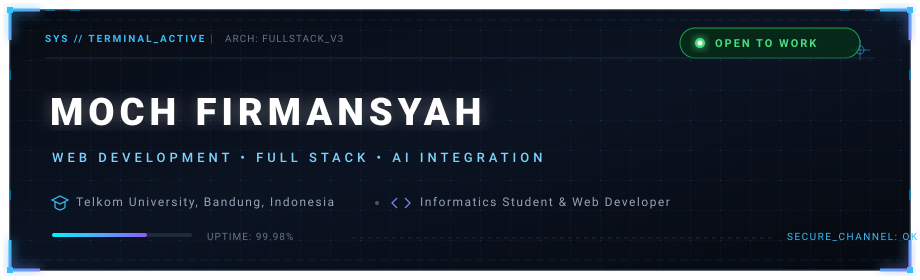
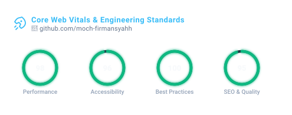
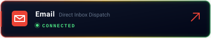

<!-- ======================= HEADER SECTION ======================= -->

  

<!-- ======================= GITHUB STATISTICS SECTION ======================= -->

  

<table width="100%" border="0" cellspacing="0" cellpadding="0">
  <tr>
    <td width="50%" align="center" style="border: 1px solid #1E293B; background: #080C14; border-radius: 8px; padding: 10px;">
      
    </td>
    <td width="50%" align="center" style="border: 1px solid #1E293B; background: #080C14; border-radius: 8px; padding: 10px;">
      
    </td>
  </tr>
</table>

 

<!-- Arcade Contribution Graph -->

  <picture>
    <source media="(prefers-color-scheme: dark)" srcset="https://raw.githubusercontent.com/moch-firmansyahh/moch-firmansyahh/output/galaga-contribution-graph-dark.svg" />
    <source media="(prefers-color-scheme: light)" srcset="https://raw.githubusercontent.com/moch-firmansyahh/moch-firmansyahh/output/galaga-contribution-graph.svg" />
    
  </picture>

  

<!-- ======================= ARSENAL SECTION ======================= -->

  

### ⚡ WEB &amp; FRONTEND

  
  
  
  
  
  
  

### 🔮 BACKEND &amp; DATABASE

  
  
  
  

### 🧬 AI &amp; INTEGRATION

  
  
  

 

<!-- ======================= CONNECT SECTION ======================= -->

  

<table width="100%" border="0" cellspacing="8" cellpadding="0">
  <tr>
    <td width="50%" align="center">
      
    </td>
    <td width="50%" align="center">
      
    </td>
  </tr>
  <tr>
    <td width="50%" align="center">
      
    </td>
    <td width="50%" align="center">
      
    </td>
  </tr>
</table>

