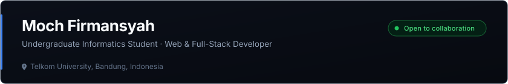

  

  
  
  
  

 

### About Me

Saya mahasiswa S1 Informatika di Telkom University, Bandung, dengan ketertarikan mendalam pada pengembangan web modern dan arsitektur full-stack. Saat ini saya fokus merancang dan membangun aplikasi web yang fungsional, performan, serta memiliki pengalaman pengguna yang bersih dan intuitif.

 

### Current Focus

- 💻 Mengembangkan aplikasi full-stack menggunakan **Next.js**, **TypeScript**, dan **Supabase**.
- 🛠️ Mendalami arsitektur backend, manajemen basis data relasional, dan integrasi API cerdas (**Google Gemini API**).
- 🤝 Terbuka untuk diskusi proyek, eksplorasi teknologi baru, dan kolaborasi tim.

 

### Tech Stack

#### Frontend

  
  
  
  

#### Backend & Database

  
  
  
  

#### Tools & Integration

  
  
  
  

 

### GitHub Statistics

  
  &nbsp;&nbsp;
  

